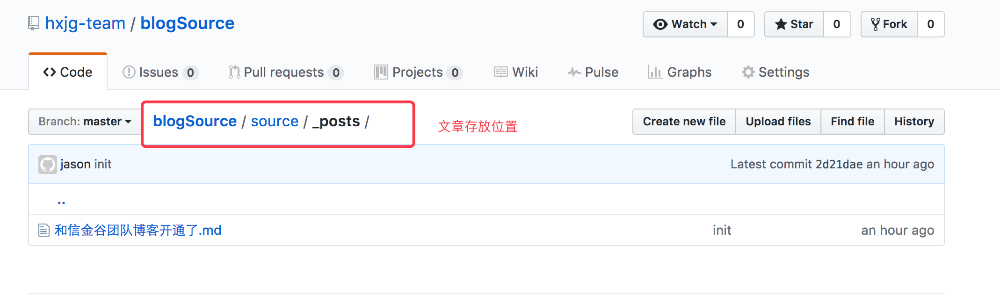
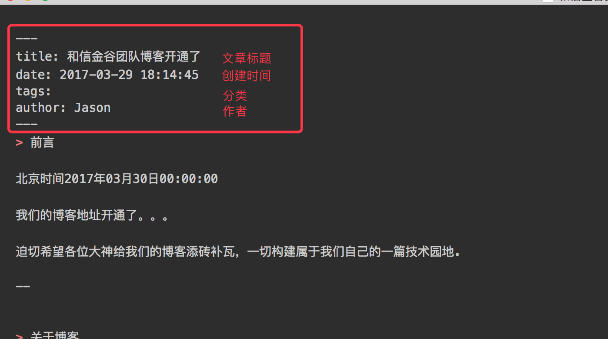
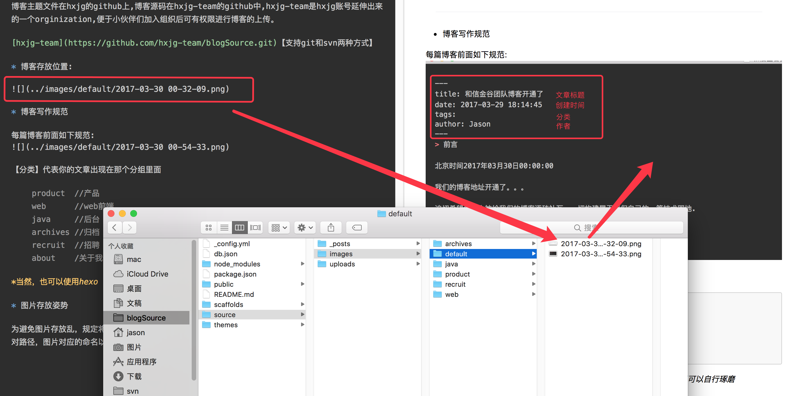

> 前言

北京时间2017年03月30日00:00:00

我们的博客地址开通了。。。

迫切希望各位大神给我们的博客添砖补瓦，一切构建属于我们自己的一篇技术园地.

--

<!-- more -->

> 关于博客

博客采用的是hexo搭建 主题采用的是NexT主题(阿里中间件团队也是使用的该主题哟.）

附上链接地址，小伙伴们膜拜一下	[阿里中间件团队博客](http://jm.taobao.org/)

Hexo 是一个简单地、轻量地、基于Node的一个静态博客框架，可以方便的生成静态网页托管在github和Heroku上,本博客部署在github，搭配Travis CI自动化部署，md文件提交到github之后自动自动化部署生成静态页面

markdown 语法参照	[Markdown 语法说明 (简体中文版) ](http://www.appinn.com/markdown/)

> 写作姿势

博客主题文件在hxjg的github上,博客源码在hxjg-team的github中,hxjg-team是hxjg账号延伸出来的一个orginization,便于小伙伴们加入组织后可有权限进行博客的上传。

[hxjg-team](https://github.com/hxjg-team/blogSource.git)【支持git和svn两种方式】

* 博客存放位置:

* 博客写作规范

每篇博客前面如下规范:

【分类】代表你的文章出现在那个分组里面

	 product	//产品
	 web		//web前端
	 java		//后台
	 archives	//归档
	 recruit	//招聘
	 about		/关于我们

*当然，也可以使用hexo new post 的方式创建博客文章，愿意‘折腾’的小伙伴可以自行琢磨*

* 图片存放姿势

为避免图片存放乱，规定将图片存放于source/images/中对应的目录中，且文章中引用图片的方式为相对路径，图片对应的命名以当前时间进行命名

暂时这么些,你学会了吗?😋

